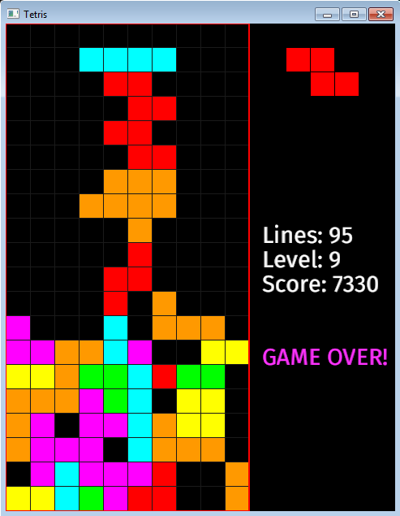

# tetris_rust
Yet another tetris clone for the Rust programming language.

Tried to stay close to the original Tetris game.
You get points for dropping blocks not for making lines, instant drops reward more points.
Every 10 lines your level is increased and the free fall speed increases by 0.05 seconds.

Keys:
- Left / Right: move block.
- Up: rotate block.
- Down / Space: instant drop.
- P: Pause.
